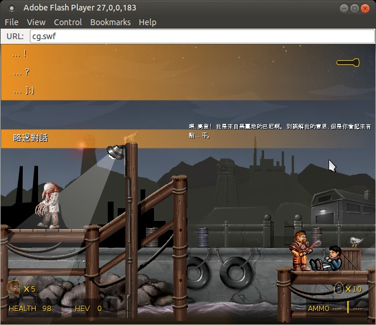

AppID: `92`

Codename Gordon can still be installed for free using the Steam URL `steam://install/92` or `steamcmd`.

Linux
-----

The embedded SWF file can be extracted with `cat cg.exe | tail -c+1198770 > cg.swf`.
MD5 checksum of cg.swf is `f3930ac0e48d5ad38e612f5acff04f3f`.

You can get a stand-alone Flash player (Flash Player Projector) directly from [Adobe](http://www.adobe.com/support/flashplayer/debug_downloads.html).

Replace `cg_languages.xml` to enable dialogs.
Dialog language must be changed in the game's graphics menu.

